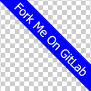
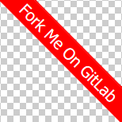

# 'Fork Me On GitLab' Ribbons

## About

- Copy and paste the html of your desired ribbon inside the body tag of the web page you want the ribbon to appear.

- You have full control over the color, rotation and placement. 

- It's just html and css. 

- Always in view in case of page scrolling.

- No external images or scripts.

- Fully GDPR Compliant.


### Black on Hot Pink - Top Right


```html
<!-- **** Begin Fork-Me-On-Gitlab-Ribbon-HTML. See MIT License at https://gitlab.com/seanwasere/fork-me-on-gitlab **** -->
<a href="[Your Repository URL Here]">
    <span style="font-family: tahoma; font-size: 20px; position:fixed; top:50px; right:-45px; display:block; -webkit-transform: rotate(45deg); -moz-transform: rotate(45deg); background-color:hotpink; color:black; padding: 4px 30px 4px 30px">Fork me on GitLab</span>
</a>
<!-- **** End Fork-Me-On-Gitlab-Ribbon-HTML **** -->
```


### White on Blue - Top Right

```html
<!-- **** Begin Fork-Me-On-Gitlab-Ribbon-HTML. See MIT License at https://gitlab.com/seanwasere/fork-me-on-gitlab **** -->
<a href="[Your Repository URL Here]">
    <span style="font-family: tahoma; font-size: 20px; position:fixed; top:50px; right:-45px; display:block; -webkit-transform: rotate(45deg); -moz-transform: rotate(45deg); background-color:blue; color:white; padding: 4px 30px 4px 30px">Fork me on GitLab</span>
</a>
<!-- **** End Fork-Me-On-Gitlab-Ribbon-HTML **** -->
```

### White on Red - Top Right

```html
<!-- **** Begin Fork-Me-On-Gitlab-Ribbon-HTML. See MIT License at https://gitlab.com/seanwasere/fork-me-on-gitlab **** -->
<a href="[Your Repository URL Here]">
    <span style="font-family: tahoma; font-size: 20px; position:fixed; top:50px; right:-45px; display:block; -webkit-transform: rotate(45deg); -moz-transform: rotate(45deg); background-color:red; color:white; padding: 4px 30px 4px 30px">Fork me on GitLab</span>
</a>
<!-- **** End Fork-Me-On-Gitlab-Ribbon-HTML **** -->
```

### Black on Yellow - Top Left

```html
<!-- **** Begin Fork-Me-On-Gitlab-Ribbon-HTML. See MIT License at https://gitlab.com/seanwasere/fork-me-on-gitlab **** -->
<a href="[Your Repository URL Here]">
    <span style="font-family: tahoma; font-size: 20px; position:fixed; top:50px; left:-45px; display:block; -webkit-transform: rotate(-45deg); -moz-transform: rotate(-45deg); background-color:yellow; color:black; padding: 4px 30px 4px 30px">Fork me on GitLab</span>
</a>
<!-- **** End Fork-Me-On-Gitlab-Ribbon-HTML **** -->
```

### Black on Cyan - Top Left

```html
<!-- **** Begin Fork-Me-On-Gitlab-Ribbon-HTML. See MIT License at https://gitlab.com/seanwasere/fork-me-on-gitlab **** -->
<a href="[Your Repository URL Here]">
    <span style="font-family: tahoma; font-size: 20px; position:fixed; top:50px; left:-45px; display:block; -webkit-transform: rotate(-45deg); -moz-transform: rotate(-45deg); background-color:cyan; color:black; padding: 4px 30px 4px 30px">Fork me on GitLab</span>
</a>
<!-- **** End Fork-Me-On-Gitlab-Ribbon-HTML **** -->
```


